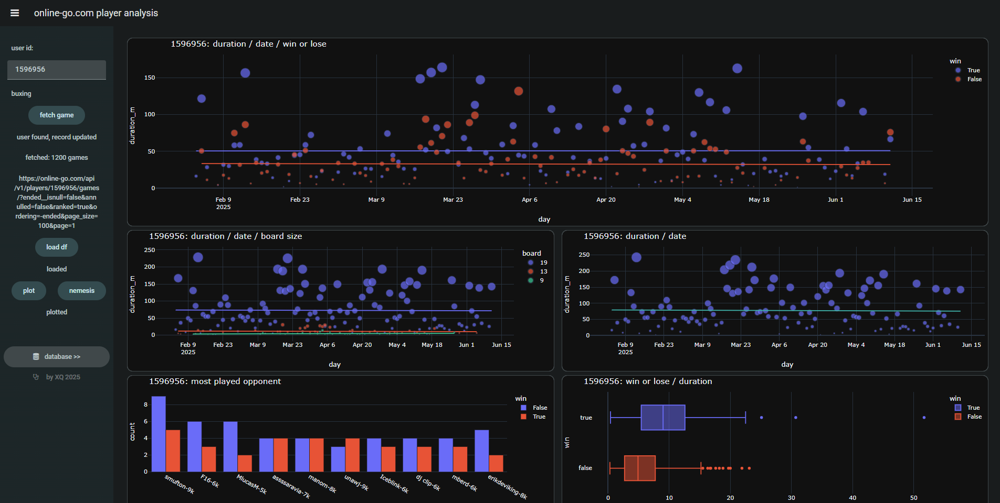

# OGS Game Analysis 📊

## Uncover Your Go Game Insights 🧐

Welcome to OGS Game Analysis\! This project provides a robust Python-based solution for analyzing your game data from the **Online Go Server (OGS)**. Whether you're a seasoned Go player looking to pinpoint areas for improvement or a data enthusiast interested in applying data analysis and visualization techniques, this tool offers valuable insights into your playing habits and performance.

By leveraging the **OGS API**, this project efficiently fetches your complete ranked game history, processes it with the powerful `pandas` library for data manipulation, and generates insightful, interactive visualizations using `plotly`. To make these analytical capabilities accessible via a web interface, it seamlessly integrates with **Anvil Uplink**, enabling a user-friendly way to interact with your data without direct code interaction.

## Features ✨

  * **Comprehensive Data Fetching:** Easily retrieve your entire **ranked game history** from the OGS API. The system uses efficient, **multi-threaded requests** to quickly download game data, even for players with thousands of games, ensuring a smooth and fast data acquisition process. 🚀
  * **Data Transformation & Cleaning:** Raw JSON data fetched from the OGS API is meticulously transformed into a clean, structured `pandas` DataFrame. This crucial step prepares the data for accurate analysis. Key transformations include:
      * Calculating precise **game durations** (in minutes).
      * Identifying and calculating **win/loss streaks** to understand performance trends.
      * Converting raw **Elo ratings** into easily understandable standard Go ranks (kyu/dan), providing a clearer picture of your progression. 🧹
  * **Interactive Visualizations:** Generate dynamic and interactive plots using `plotly`, offering deep insights into your gameplay. Each visualization allows for zooming, panning, and hovering to explore data points in detail: 📈
      * **Daily Play Duration:** Understand your playing time distribution over days and its correlation with wins and losses. This helps identify optimal playing times or potential burnout patterns. ⏱️
      * **Board Size Preferences:** Analyze how your game duration and win/loss ratio vary across different board sizes (e.g., 9x9, 13x13, 19x19). This can highlight strengths or weaknesses on specific board sizes. 📏
      * **Opponent Analysis:** Identify your most frequent opponents and analyze your detailed win/loss records against them, including specific game outcomes. This can reveal "nemeses" or favorable matchups. ⚔️
      * **Game Duration vs. Outcome:** Explore the relationship between the length of your games and their outcomes (win/loss). This might suggest if you perform better in shorter, faster games or longer, more complex ones. 🏁
      * **Time of Day Play Patterns:** Discover at what hours you play most frequently and how this correlates with your performance. This can help you understand if certain times of day are more conducive to your best play. 🌙
  * **Anvil Uplink Integration:** This project includes a ready-to-use **Anvil Uplink server module** (`app.py`). This allows you to expose the Python analysis functions as callable methods (`@anvil.server.callable`) to a web application built with Anvil. This integration provides a seamless, user-friendly way for anyone to interact with your data and generate analyses without needing direct Python coding experience. 🔗
  * **Docker Support:** The project comes with a `Dockerfile` and `docker-compose.yml` for straightforward deployment. This containerization ensures a consistent and isolated environment for running the Anvil Uplink server, simplifying setup and dependency management across different systems. 🐳

## Live Demo 📸

Below are screenshots illustrating the interactive visualizations generated by the analysis:

*Figure 1: Example plot showing daily play duration and win/loss correlation.*


*Figure 2: Example plot displaying opponent win/loss analysis.*


*Figure 3: Example view of user database.*


## Technologies Used 🛠️

  * **Python:** The foundational language for all data fetching, processing, analysis, and backend logic. 🐍
  * **Requests:** A popular and robust HTTP library used to make efficient calls to the **OGS REST API** for retrieving game data. 📡
  * **Pandas:** An essential data manipulation and analysis library. It's used extensively for transforming raw JSON data into structured DataFrames, cleaning data, and performing complex calculations. 🐼
  * **Plotly:** A powerful library for creating interactive, publication-quality statistical graphics. It's used to generate all the dynamic charts that allow for deep data exploration. 📊
  * **Anvil Uplink:** An Anvil feature that enables Python code running anywhere (like your local machine or a Docker container) to communicate with an **Anvil web app**. It's crucial for connecting the backend analysis logic to a web frontend. ☁️
  * **Docker:** A platform for developing, shipping, and running applications in containers. It's used here to containerize the Python backend, making deployment consistent and isolated. 🚢

## Getting Started 🚀

These instructions will help you get a copy of the project up and running on your local machine for development and testing purposes.

### Prerequisites ✅

Before you begin, ensure you have the following installed:

  * **Python 3.8+**: This project leverages features available in Python 3.8 and newer.
  * **Docker (optional)**: Required if you plan to deploy the Anvil Uplink server using containerization. You can download Docker Desktop from the [official Docker website](https://www.docker.com/products/docker-desktop).
  * **Anvil Account (optional)**: Necessary if you intend to integrate this backend with an Anvil web application. You can sign up for a free account at [anvil.works](https://anvil.works).

### Installation 💻

Follow these steps to set up the project locally:

1.  **Clone the repository:**
    Open your terminal or command prompt and run the following command to download the project files:

    ```bash
    git clone https://github.com/thexqin/ogs-analysis.git
    cd ogs-analysis
    ```

2.  **Create a virtual environment (recommended):**
    Using a virtual environment isolates your project's dependencies from other Python projects.

    ```bash
    python -m venv venv
    source venv/bin/activate # On Windows, use `venv\Scripts\activate`
    ```

    (You'll know it's active when `(venv)` appears at the beginning of your terminal prompt.)

3.  **Install dependencies:**
    With your virtual environment active, install all required Python libraries:

    ```bash
    pip install -r requirements.txt
    ```

    This command reads the `requirements.txt` file and installs all listed packages.

4.  **Set up Anvil Uplink (if using Anvil):**
    If you plan to use the Anvil web integration, you need to configure your Anvil Uplink key.

      * **Rename `.env.example` to `.env`**: This file is used to store environment variables securely.

      * **Add your Anvil Uplink key**: Open the newly renamed `.env` file and add your unique Anvil Uplink key:

        ```
        ANVIL_UPLINK_KEY='YOUR_ANVIL_UPLINK_KEY'
        ```

      * **Obtain your Anvil Uplink key**: You can find this key in your Anvil app's settings under "Uplink" or "Publishing" sections. It's crucial for your local Python script to connect to your Anvil web app.

## Usage 💡

### Running the Anvil Uplink Server 🖥️

Once installed, you can start the Anvil Uplink server. This server will connect your local Python environment to your Anvil web application, making the analysis functions available for use in your web frontend.

From the `backend/` directory (or the root if you adjust paths), run:

```bash
python app.py
```

Upon successful connection, you will see output in your terminal indicating that the Uplink is connected to your Anvil app. Your Python functions decorated with `@anvil.server.callable` are now accessible from your Anvil frontend.

### Example Anvil Client-Side Code (Form1.py snippet) 🌐

This project is designed to be paired with an Anvil web frontend. The provided sample `Form1.py` demonstrates how you might interact with the Anvil Uplink functions (defined in `app.py`) from an Anvil app's client-side code. This code snippet shows how to call server-side functions and update plot components in a web interface.

```python
import anvil.server
import plotly.graph_objects as go
from anvil import *

class Form1(Form1Template):
  def __init__(self, **properties):
    self.init_components(**properties)
    # Set default Plotly theme for consistency
    Plot.templates.default = 'plotly_dark'

    # Automatically load and display plots when the app opens
    self.load_id()       # Loads user ID and initial data
    self.plot_id()       # Generates general user plots (e.g., daily play, board size)
    self.plot_nemesis()  # Generates opponent and time-based plots

  def sync_id_name(self):
    # This function would typically retrieve the user's OGS ID and name
    # from input fields or user sessions in the Anvil app.
    # (See full sample code for implementation details.)
    pass

  def fetch_id(self):
    # This function would call an Anvil server function to fetch
    # and store new game data for a given OGS user ID.
    # (See full sample code for implementation details.)
    pass

  def load_id(self):
    # This function would load existing user data from the Anvil Data Table
    # or initiate a fetch if data is not present/outdated.
    # (See full sample code for implementation details.)
    pass

  def plot_id(self):
    user_id, user_name = self.sync_id_name()
    if user_id:
      self.label_9.text = 'loading...' # Display loading message
      # Call the server-side function to get plot data
      fig1, fig2, fig3 = anvil.server.call('get_plot', user_id)
      # Update Anvil plot components with the generated Plotly figures
      # (Example: self.plot_component1.figure = fig1)
      # ... (update other plot components as needed)
      self.label_9.text = '' # Clear loading message
      
  def plot_nemesis(self):
    user_id, user_name = self.sync_id_name()
    if user_id:
      self.label_9.text = 'loading...' # Display loading message
      # Call server-side functions for nemesis and time-based plots
      fig4, fig5 = anvil.server.call('get_plot_nemesis', user_id)
      fig6 = anvil.server.call('get_plot_time', user_id)
      # Update Anvil plot components
      # (Example: self.plot_component4.figure = fig4)
      # ... (update other plot components as needed)
      self.label_9.text = '' # Clear loading message
```

### Docker Deployment 🚢

For a more robust and consistent deployment, especially in production or shared environments, you can use Docker to containerize the Anvil Uplink server.

1.  **Build the Docker image:**
    Navigate to the directory containing your `Dockerfile` (e.g., `backend/`) and run:

    ```bash
    docker build -t ogs-uplink .
    ```

    This command builds a Docker image named `ogs-uplink` based on the instructions in your `Dockerfile`.

2.  **Run the Docker container using docker-compose:**
    Ensure your `.env` file (containing your `ANVIL_UPLINK_KEY`) is present in the same directory as your `docker-compose.yml`. Then, run:

    ```bash
    docker-compose up -d
    ```

    This command starts the container in detached mode (`-d`), running your Anvil Uplink server in the background. `docker-compose` reads the `docker-compose.yml` file to set up the service, including mounting the `.env` file for your Anvil key.

## Project Structure 📁

Understanding the project's layout will help you navigate and contribute effectively.

```
.
├── frontend/
│   ├── Form1.py            # Main form/page for the Anvil web app, handles UI and calls backend functions.
│   ├── Form2.py            # (Optional) Another example form/page for different sections of the web app.
│   └── ...                 # Other Anvil frontend files (forms, modules, assets) as part of your web app.
├── backend/
│   ├── Dockerfile          # Instructions for building the Docker image for the Python backend.
│   ├── app.py              # The main Python script that runs the Anvil Uplink server and defines callable analysis functions.
│   ├── docker-compose.yml  # Defines how Docker services (like the Anvil Uplink server) are run and configured.
│   ├── .env.example        # Example file for environment variables (like ANVIL_UPLINK_KEY), to be renamed to .env.
│   └── requirements.txt    # Lists all Python dependencies required by the `app.py` for pip installation.
└── README.md               # This documentation file.
```

### `table_db` Schema 🗄️

This project strategically utilizes an **Anvil Data Table** named `table_db` to persistently store fetched user data. This approach offers several advantages: it avoids re-fetching data from OGS for every analysis request, significantly speeding up subsequent data retrievals, and ensures data availability even if the OGS API has temporary issues.

Here's a detailed breakdown of the `table_db` schema:

| Column Name   | Type       | Description                                                                                                                                                                                                                                     |
| :------------ | :--------- | :---------------------------------------------------------------------------------------------------------------------------------------------------------------------------------------------------------------------------------------------- |
| `user_id`     | `number`   | The **unique numerical ID** assigned to each user on the Online Go Server (OGS). This serves as the primary key for identifying and retrieving specific user's game data.                                                                          |
| `date`        | `datetime` | A timestamp indicating **when the user's game data was last successfully fetched** from the OGS API and stored in this table. This is crucial for managing data freshness and deciding when to re-fetch.                                         |
| `user_name`   | `string`   | The **username** corresponding to the `user_id`. Stored for easier identification and display within the Anvil web application.                                                                                                                   |
| `df_markdown` | `string`   | A Markdown formatted string representation of a **summary of the latest game data**. This is designed to be directly usable and displayed within Anvil components (e.g., a `Label` or `RichText` component) for a quick overview.                 |
| `df_csv`      | `string`   | A **CSV formatted string** of the *full, raw game data*. This comprehensive string can be loaded back into a `pandas` DataFrame (`pd.read_csv(io.StringIO(df_csv_string))`) by the backend Python code whenever detailed analysis is required. |


## Contributing 🤝

Contributions are highly valued and welcome\! If you have suggestions for improvements, new features, or bug fixes, please don't hesitate to open an issue to discuss them or submit a pull request with your proposed changes.

### How to Contribute:

1.  **Fork the repository.**
2.  **Create a new branch** (`git checkout -b feature/YourFeatureName` or `bugfix/YourBugName`).
3.  **Make your changes.**
4.  **Write clear, concise commit messages.**
5.  **Push your branch** (`git push origin feature/YourFeatureName`).
6.  **Open a Pull Request** explaining your changes and their benefits.

## License 📄

This project is open-source and available under the [MIT License](https://www.google.com/search?q=https://github.com/thexqin/ogs-analysis/blob/main/LICENSE). This means you are free to use, modify, and distribute the code for both commercial and non-commercial purposes, provided you include the original copyright and license notice.

-----

How does this more detailed version look to you? Is there anything else you'd like to expand on or clarify?
